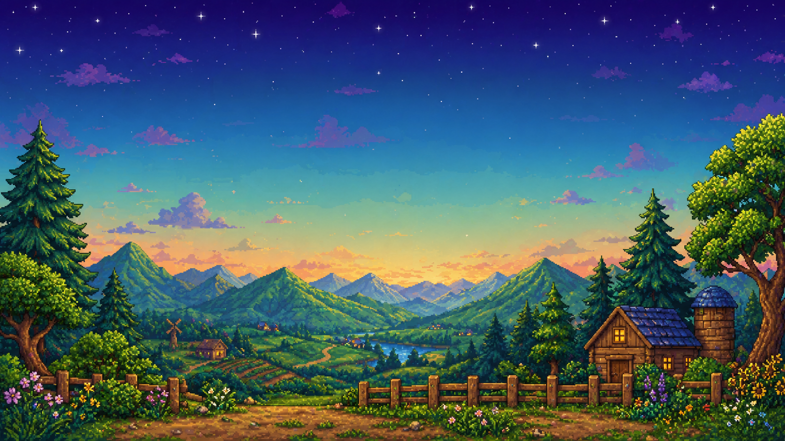
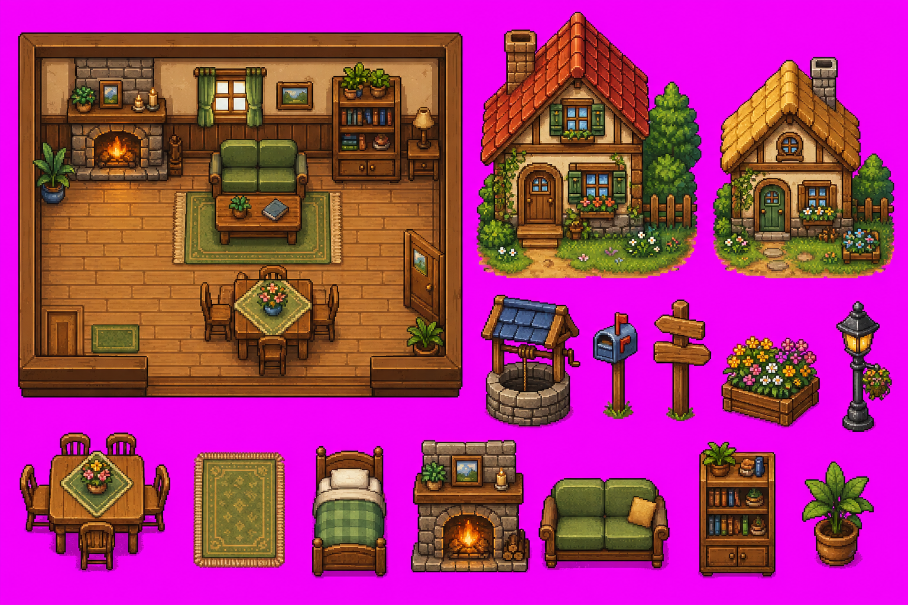
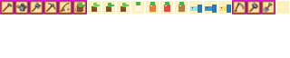

# Pixel Homestead

Pixel Homestead is a macOS-first C# cozy farming and life-simulation game foundation built with MonoGame DesktopGL. The project is focused on a bright pixel-art countryside fantasy: build a farm, grow crops, fish in ponds, explore an expanding landscape, return home, and progress through calm daily routines at your own pace.

The current build is not a finished commercial game yet. It is a playable, modular foundation with original generated pixel-art assets, custom game UI, core farming/fishing/economy systems, save/load, settings, and automated tests.

## Visual Showcase

### Title Screen Direction



The title screen uses an original generated pixel-art countryside panorama with a night sky, mountains, trees, flowers, fences, and warm cozy lighting. The in-game menu overlays a custom wooden title sign and parchment-style buttons over this background.

### Interior and Town Asset Direction



The house/interior pass adds a cozy living room screen, town house concepts, well, mailbox, signpost, planter, lamp post, fireplace, bed, sofa, bookshelf, and warm wood furniture references. These assets are original generated project assets and are wired into the runtime where useful.

### Tool and Item Icons



The hotbar uses a generated icon source for farming tools and hand-authored/generated atlas integration for tools, seeds, crops, and fish.

## Current Gameplay Features

- Custom pixel-rendered MonoGame desktop window with point-clamped scaling.
- Polished main menu, pause menu, settings screen, credits, HUD, hotbar, inventory panel, toast messages, and dialogue UI foundation.
- Tile-based starter world with a farmhouse, farm plot, pond, paths, fences, trees, bushes, props, shipping box, and a small town area.
- Infinite deterministic procedural terrain outside the authored starter area with trees, bushes, flowers, stones, and ponds.
- Smooth player movement with acceleration, deceleration, sprinting, facing direction, walk animation, camera follow, and collision.
- Swimming support: the player can enter water, gets a swim visual treatment, bubbles appear, and oxygen drains while swimming.
- House entry support: interact at the farmhouse door to open a cozy living room screen with sleep and exit actions.
- Farming loop: hoe soil, plant seeds, water crops, sleep to grow, and harvest mature crops.
- Fishing foundation: cast near water, wait for a bite, catch fish, and add them to inventory.
- Inventory system with stacking, hotbar integration, mouse selection, click/drag movement, and stack merging.
- Economy system with shipping box, sellable item validation, coins, and overnight payout.
- Day/time system, energy system, auto-save on sleep, manual save, and JSON save/load.
- Collision debug overlay with `F3` for blocked tiles, player hitbox, and interaction target.
- Settings persistence for music volume, SFX volume, window scale, fullscreen, and debug collision.

## Run

```bash
dotnet run --project src/PixelHomestead.Game/PixelHomestead.Game.csproj
```

## Validate

```bash
dotnet csharpier check .
dotnet build PixelHomestead.sln --no-restore
dotnet test tests/PixelHomestead.SmokeTests/PixelHomestead.SmokeTests.csproj --no-restore --collect:"XPlat Code Coverage"
```

## Developer Workflow

```bash
dotnet tool restore
dotnet csharpier format .
dotnet csharpier check .
./scripts/check.sh
```

- VS Code: use `Run and Debug` → `Run Pixel Homestead`.
- JetBrains Rider: use the checked-in `.run/Pixel Homestead.run.xml` run configuration.
- Tests use xUnit with `Microsoft.NET.Test.Sdk` and `coverlet.collector`.
- Formatting uses CSharpier.
- CI runs on GitHub Actions for restore, CSharpier, build, and xUnit tests with coverage.

## Controls

- `WASD` / arrow keys: move
- `Shift`: sprint
- `E`: interact, enter home, leave home, sleep, or catch fish when prompted
- Left click: use selected item, click UI, select hotbar slots
- Right click: cancel / close menu
- `Tab` / `I`: inventory
- `Esc`: pause or close menu
- `1-9`: select hotbar slot
- `F3`: toggle collision debug overlay

## Architecture

- `src/PixelHomestead.Core/Core`: shared primitives
- `src/PixelHomestead.Core/Player`: player state
- `src/PixelHomestead.Core/World`: tile map, procedural terrain, collision, crop state
- `src/PixelHomestead.Core/Items`: item, crop, inventory, and tool models
- `src/PixelHomestead.Core/Farming`: farming system
- `src/PixelHomestead.Core/Fishing`: fishing system and fish definitions
- `src/PixelHomestead.Core/Saving`: save system
- `src/PixelHomestead.Core/Economy`: shipping and coin economy
- `src/PixelHomestead.Core/Time`: day/time system
- `src/PixelHomestead.Core/Energy`: energy system
- `src/PixelHomestead.Core/Data`: JSON data loading
- `src/PixelHomestead.Game`: MonoGame rendering, input, menus, HUD, and app entrypoint
- `src/PixelHomestead.Game/Data`: item, crop, tool, fish, and tile definitions copied to output
- `src/PixelHomestead.Game/Assets`: generated sprite, tile, UI, menu, interior, and audio-ready folders
- `src/PixelHomestead.Game/Rendering`: world rendering, camera, and generated atlas loading
- `src/PixelHomestead.Game/Player`: continuous player controller and renderer
- `src/PixelHomestead.Game/Effects`: particles and game-feel effects
- `src/PixelHomestead.Game/Input`: input bindings and future remapping structure
- `src/PixelHomestead.Game/UI`: game UI renderer, menus, HUD, toast/dialogue rendering, and pixel font

## Generated Assets

The project currently includes original generated PNG assets in `src/PixelHomestead.Game/Assets/Generated`. These are checked in so the game runs immediately without requiring an asset-generation step.

```bash
python3 scripts/generate_assets.py
```

The generator rebuilds deterministic atlases and integrates the generated tool source sheet into the runtime icon atlas.

## Save Location

Saves are written to the current user's application data folder under `PixelHomestead/savegame.json`. Settings are written under `PixelHomestead/settings.json`.

## QA Status

The automated suite covers content references, item validation, farming, fishing, economy, energy, save/load, corrupt save fallback, procedural terrain, collision-critical tiles, water traversal, and inventory stack behavior.

Manual visual QA is still recommended for exact feel: walk every house/tree/water boundary with `F3`, test entering/leaving the home, swim until oxygen drains, click every menu button, and verify farming/fishing/sleeping in a real game window.
