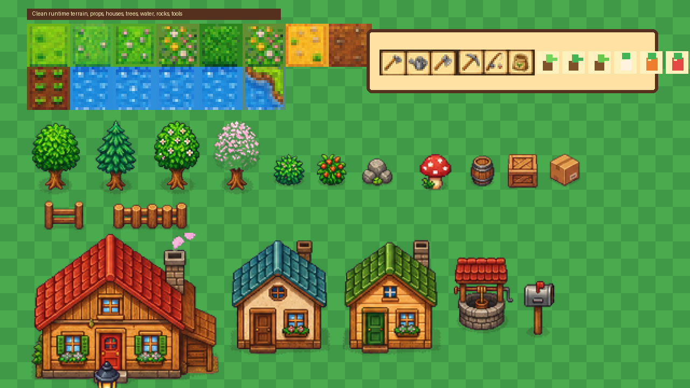

# QuietValley

QuietValley is a macOS-first C# cozy farming and life-simulation game foundation built with MonoGame DesktopGL. The project is focused on a bright pixel-art countryside fantasy: build a farm, grow crops, fish in ponds, explore an expanding landscape, return home, and progress through calm daily routines at your own pace.

The current build is not a finished commercial game yet. It is a playable, modular foundation with original generated pixel-art assets, custom game UI, core farming/fishing/economy systems, save/load, settings, and automated tests.

## Visual Showcase

### Title Screen Direction


The title screen uses a new original generated pixel-art countryside scene with a warm valley sunset, farmhouse, pond, fences, lanterns, flowers, and built-in wooden/parchment menu plaques. The runtime draws crisp labels and hover highlights over the generated UI artwork.

### Runtime Asset Showcase



The active runtime atlases now use the generated replacement assets for grass, water, farm soil, dirt paths, rocks, trees, bushes, props, fences, houses, town objects, swimming frames, and water ripples. Chroma-key purple backgrounds are stripped during atlas generation.

### Interior and Town Asset Direction


The house/interior pass adds a cozy living room screen, town house concepts, well, mailbox, signpost, planter, lamp post, fireplace, bed, sofa, bookshelf, and warm wood furniture references. These assets are original generated project assets and are wired into the runtime where useful.
The documentation sheet is composited on a neutral meadow/parchment background so there is no visible purple chroma-key backdrop.

### Tool and Item Icons


The hotbar uses a regenerated clean 3x3 parchment tool source sheet for hoe, watering can, axe, pickaxe, fishing rod, seed bag, scythe, hammer, and shovel. Legacy magenta-backed tool sources were removed from the runtime icon pipeline.

## Current Gameplay Features

- Custom pixel-rendered MonoGame desktop window with point-clamped scaling.
- Polished main menu, pause menu, settings screen, credits, HUD, hotbar, inventory panel, toast messages, and dialogue UI foundation.
- Tile-based starter world with a farmhouse, farm plot, pond, paths, fences, trees, bushes, props, shipping box, and a small town area.
- Infinite deterministic procedural terrain outside the authored starter area with trees, bushes, flowers, stones, and ponds.
- Smooth player movement with acceleration, deceleration, sprinting, facing direction, walk animation, camera follow, and collision.
- Swimming support: the player can enter water, keeps the same character identity as the walking sprite, gets ripple/bubble treatment, and oxygen drains while swimming.
- House entry support: interact at the farmhouse door to open a cozy living room screen with sleep and exit actions.
- Farming loop: hoe soil, plant seeds, water crops, sleep to grow, and harvest mature crops.
- Fishing foundation: cast near water, wait for a bite, catch fish, and add them to inventory.
- Inventory system with stacking, hotbar integration, mouse selection, click/drag movement, and stack merging.
- Economy system with shipping box, sellable item validation, coins, and overnight payout.
- Day/time system, energy system, auto-save on sleep, manual save, and JSON save/load.
- Atomic save/settings writes with corrupt-save fallback and defensive save-data validation.
- Collision debug overlay with `F3` for blocked tiles, player hitbox, and interaction target.
- Settings persistence for music volume, SFX volume, window scale, fullscreen, and debug collision.

## Run

```bash
dotnet run --project src/QuietValley.Game/QuietValley.Game.csproj
```

## Validate

```bash
dotnet csharpier check . --ignore-path .csharpierignore --no-msbuild-check
dotnet build QuietValley.sln --no-restore
dotnet test tests/QuietValley.SmokeTests/QuietValley.SmokeTests.csproj --no-restore --collect:"XPlat Code Coverage"
```

## Developer Workflow

```bash
dotnet tool restore
dotnet csharpier format . --ignore-path .csharpierignore --no-msbuild-check
dotnet csharpier check . --ignore-path .csharpierignore --no-msbuild-check
./scripts/check.sh
```

- VS Code: use `Run and Debug` → `Run QuietValley`.
- JetBrains Rider: use the checked-in `.run/QuietValley.run.xml` run configuration.
- Tests use xUnit with `Microsoft.NET.Test.Sdk` and `coverlet.collector`.
- Formatting uses CSharpier.
- CI runs on GitHub Actions for restore, CSharpier, build, and xUnit tests with coverage.

## Controls

- `WASD` / arrow keys: move
- `Shift`: sprint
- `E`: interact, enter home, leave home, sleep, or catch fish when prompted
- Left click: use selected item, click UI, select hotbar slots
- Right click: cancel / close menu
- `Tab` / `I`: inventory
- `Esc`: pause or close menu
- `1-9`: select hotbar slot
- `F3`: toggle collision debug overlay

## Architecture

- `src/QuietValley.Core/Core`: shared primitives
- `src/QuietValley.Core/Player`: player state
- `src/QuietValley.Core/World`: tile map, procedural terrain, collision, crop state
- `src/QuietValley.Core/Items`: item, crop, inventory, and tool models
- `src/QuietValley.Core/Farming`: farming system
- `src/QuietValley.Core/Fishing`: fishing system and fish definitions
- `src/QuietValley.Core/Saving`: save system
- `src/QuietValley.Core/Economy`: shipping and coin economy
- `src/QuietValley.Core/Time`: day/time system
- `src/QuietValley.Core/Energy`: energy system
- `src/QuietValley.Core/Data`: JSON data loading
- `src/QuietValley.Game`: MonoGame rendering, input, menus, HUD, and app entrypoint
- `src/QuietValley.Game/Data`: item, crop, tool, fish, and tile definitions copied to output
- `src/QuietValley.Game/Assets`: generated sprite, tile, UI, menu, interior, and audio-ready folders
- `src/QuietValley.Game/Rendering`: world rendering, camera, and generated atlas loading
- `src/QuietValley.Game/Player`: continuous player controller and renderer
- `src/QuietValley.Game/Effects`: particles and game-feel effects
- `src/QuietValley.Game/Input`: input bindings and future remapping structure
- `src/QuietValley.Game/UI`: game UI renderer, menus, HUD, toast/dialogue rendering, and pixel font

## Generated Assets

The project currently includes original generated PNG assets in `src/QuietValley.Game/Assets/Generated`. These are checked in so the game runs immediately without requiring an asset-generation step.

```bash
python3 scripts/generate_assets.py
```

The generator rebuilds runtime atlases from the generated source sheets, removes chroma-key/purple background artifacts, and integrates the clean parchment tool source sheet into the runtime icon atlas.
Build outputs, packaged releases, coverage reports, and temporary atlas-cleaning files are ignored so only source assets and intentional documentation screenshots are versioned.

## Downloads

Packaged builds are published on GitHub Releases when available:

- **macOS (recommended)**: download `QuietValley-osx-arm64.zip` (Apple Silicon) or `QuietValley-osx-x64.zip` (Intel), unzip it, and double-click `QuietValley.app` to play. You can also drag it into `/Applications` first.
- **macOS (DMG)**: download the `.dmg` file. Opening a `.dmg` mounts it as a virtual disk in Finder — this is normal macOS behaviour for disk images. Drag `QuietValley.app` from the disk window into the `Applications` shortcut, then eject the disk and launch the app from Applications.
- **Windows**: download `QuietValley-win-x64.zip`, extract it, open the `win-x64` folder, and run `QuietValley.Game.exe`.

The macOS release script creates a real `.app` bundle. If Apple Developer ID credentials are configured in GitHub Actions, the app is signed, notarized, and stapled for normal Gatekeeper launch. Without those credentials, local builds are ad-hoc signed only, so macOS may report the app as damaged or unverified after download; use right-click > Open for local testing, or remove quarantine with `xattr -dr com.apple.quarantine /Applications/QuietValley.app`.

## Save Location

Saves are written to the current user's application data folder under `QuietValley/savegame.json`. Settings are written under `QuietValley/settings.json`.
Save and settings writes use a temporary file followed by an atomic replace so an interrupted write is less likely to corrupt the active file.

## License

QuietValley is open source under the [MIT License](LICENSE).

## QA Status

The automated suite covers content references, item validation, farming, fishing, economy, energy, save/load, corrupt save fallback, procedural terrain, collision-critical tiles, water traversal, and inventory stack behavior.

Manual visual QA is still recommended for exact feel: walk every house/tree/water boundary with `F3`, test entering/leaving the home, swim until oxygen drains, click every menu button, and verify farming/fishing/sleeping in a real game window.
